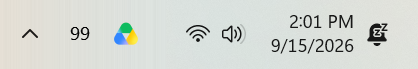

# Codex Token Tracker

A small, portable Windows tray app that displays your remaining ChatGPT Work / Codex usage as a percentage.

> [!TIP]
> **Download version 1.1**
>
> **[Download TokenTracker.exe](https://github.com/verified-human-42/codex-token-tracker/releases/download/v1.1/TokenTracker.exe)** · [Release notes](https://github.com/verified-human-42/codex-token-tracker/releases/tag/v1.1)
>
> Requires Windows 10/11, .NET Framework 4.8, internet access, and an existing Codex sign-in with your ChatGPT account. The executable is unsigned.

## Tray icon



## Use

Run **TokenTracker.exe**. No installation or app window. Right-click the tray icon for usage, reset times, refresh, and Quit. Windows may initially place it under the tray's hidden-icons arrow; drag it into the visible tray.

- Plus: five-hour percentage above weekly percentage.
- Pro (including Pro Lite): weekly percentage fills the icon.
- Red: 0–10% left. Yellow: 11–25%. Black: above 25%.
- Plain Segoe UI digits on a transparent background, drawn at the tray's pixel size.
- Numbers represent percentages; the percent sign is omitted in the tiny icon for legibility.
- Plus refreshes every 20 seconds; Pro refreshes every minute. Unavailable or expired data shows `?`, never a made-up percentage.

## Account connection

Uses the current Windows user's existing Codex ChatGPT sign-in (`%USERPROFILE%\.codex\auth.json`, or `%CODEX_HOME%\auth.json`). ChatGPT Work and Codex share usage. No credentials are bundled, copied, or logged. The app reads the sign-in afresh on each refresh. If it expires, open Codex and sign in again. ChatGPT browser sign-in alone is insufficient.

This uses ChatGPT's internal usage endpoint, which is not a stable public API and can change. No paid model requests are made. Requires internet access and Windows with .NET Framework 4.8 (standard on current Windows 10/11). The EXE is portable; moving it to another PC requires that PC's own Codex sign-in. No automatic startup or registry settings are installed.

## Build

Run `build.ps1` using Windows PowerShell. Source is in `TokenTracker.cs`. `TokenTracker.exe --test` runs parser/color/rendering checks and a live read, writing results under `checks` in the working directory.

```powershell
.\build.ps1
.\TokenTracker.exe
```

Quit the running tracker before rebuilding. The build uses the Windows .NET Framework compiler; no NuGet packages are needed.

## Privacy and limitations

Authentication is sent only to ChatGPT's usage endpoint over HTTPS. No analytics or account information are included in the release. This is an unofficial utility and is not affiliated with OpenAI. See [OpenAI's usage documentation](https://learn.chatgpt.com/docs/pricing) for how ChatGPT Work and Codex share usage.
