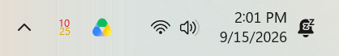

# Codex Token Tracker

Your ChatGPT Work / Codex usage, right in the Windows tray. For people who check their limits like it's the stock market.

> [!TIP]
> **Portable app. No install needed.** Download the EXE and run it.
>
> **[Download v1.1](https://github.com/verified-human-42/codex-token-tracker/releases/download/v1.1/TokenTracker.exe)** · [Release notes](https://github.com/verified-human-42/codex-token-tracker/releases/tag/v1.1)
>
> Needs Windows 10/11, .NET Framework 4.8, internet access, and a Codex sign-in with your ChatGPT account.

## The tiny numbers

**Pro:** weekly percentage left. Updates every minute.


**Plus:** five-hour percentage on top, weekly below. Updates every 20 seconds.



## Quick tips

- Right-click for reset times, refresh, or Quit.
- Can't see it? Windows probably hid it under the tray arrow. Drag it out.
- Seeing `?`? Check your connection or sign in to Codex again. A browser sign-in alone won't work.

It uses your existing Codex sign-in on each PC. No analytics or paid model requests. Checking the meter doesn't run the meter.

## Build it yourself

Quit the app, then run this in Windows PowerShell:

```powershell
.\build.ps1
```

Unofficial and unsigned. It uses ChatGPT's internal usage endpoint, so service changes may break it.
